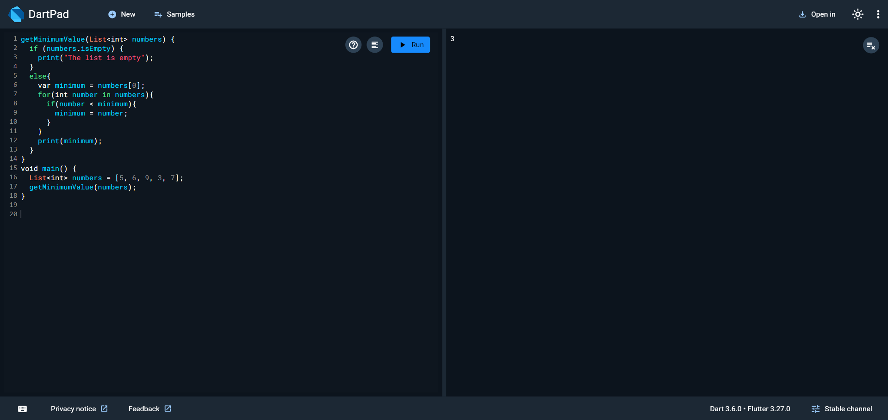

# GetMinimumValue

## Description
getMinimumValue function takes a list of integers, numbers, as an input and determines the minimum value within the list

## How to Run
1. Clone the repository or copy the `main.dart` file to your local system.
2. Navigate to the project directory in your terminal.
3. Run the program using the following command:
   ```bash
   dart run main.dart

   
## Example Output



